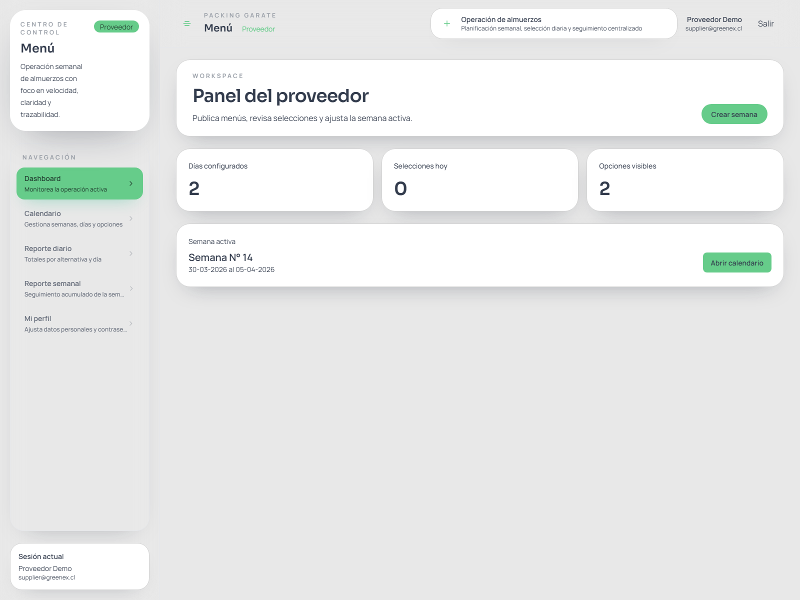
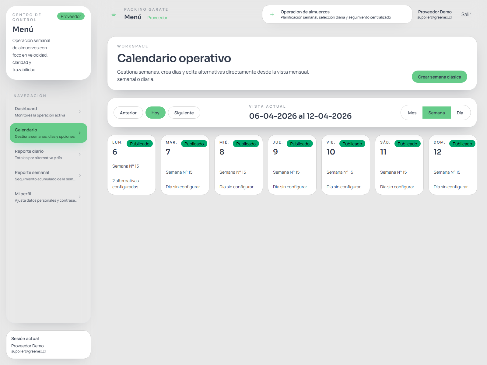
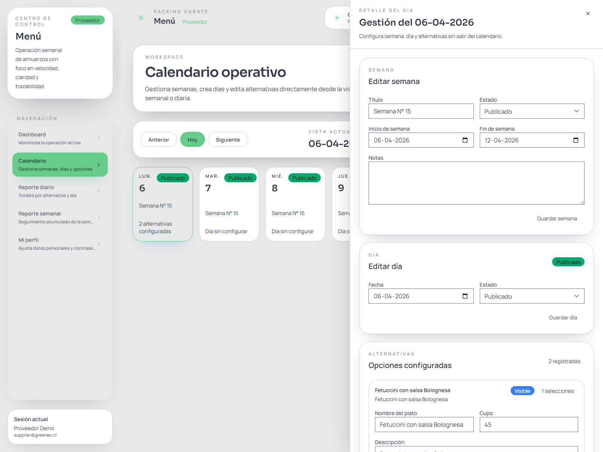
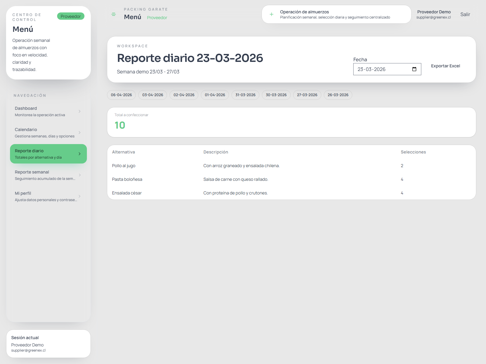
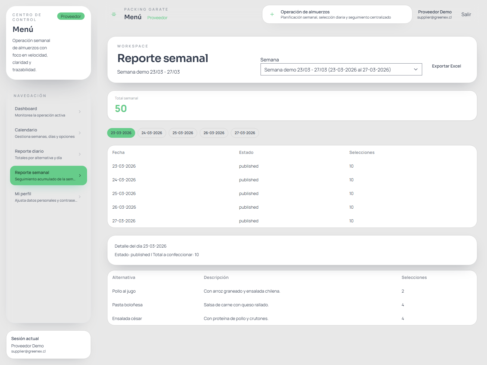

# Manual de Usuario: Proveedor

> Este manual explica cómo acceder a la plataforma **Menú** y operar el perfil **Proveedor** para planificar semanas, configurar días, administrar alternativas y revisar reportes.  
> Las capturas fueron tomadas en un ambiente de ejemplo; algunos nombres, fechas o cantidades pueden variar en producción.

*Figura 1. Pantalla de acceso a Menú.*

## 1. Objetivo del perfil Proveedor

El perfil **Proveedor** permite gestionar la operación semanal de almuerzos para el packing:

- revisar el estado de la semana activa
- navegar por el calendario en vista mensual, semanal o diaria
- crear y editar semanas
- configurar días de menú
- crear y actualizar alternativas por cada día
- definir cupos y visibilidad de cada alternativa
- revisar reportes diarios y semanales
- exportar reportes a Excel nativo (`.xlsx`)

## 2. Requisitos para ingresar

Antes de usar la plataforma, asegúrate de contar con:

- la URL oficial entregada por la empresa
- un usuario activo con rol **Proveedor**
- acceso con Google corporativo o con correo y contraseña

## 3. Inicio de sesión

### Opción A: acceso con Google corporativo

1. Ingresa a la URL del sistema.
2. Presiona **Continuar con Google**.
3. Selecciona tu cuenta corporativa autorizada.
4. Confirma el acceso.

### Opción B: acceso con correo y contraseña

1. Ingresa a la URL del sistema.
2. Escribe tu correo en el campo **Correo**.
3. Escribe tu clave en **Contraseña**.
4. Si lo necesitas, activa **Mantener sesión iniciada**.
5. Presiona **Entrar**.

### Recuperación de clave

Si tu organización habilitó restablecimiento de contraseña:

1. Haz clic en **¿Olvidaste tu contraseña?**
2. Ingresa tu correo.
3. Sigue el enlace recibido por email.

## 4. Estructura general del perfil

Cuando ingresas correctamente, verás:

- una barra lateral con la navegación principal
- una cabecera superior con tu nombre, correo y botón **Salir**
- un área central de trabajo
- mensajes de confirmación o error cuando corresponda

Las opciones disponibles en el menú lateral son:

- **Dashboard**
- **Calendario**
- **Reporte diario**
- **Reporte semanal**
- **Mi perfil**

## 5. Dashboard del proveedor

El dashboard entrega una visión rápida del estado operativo:

- **Días configurados**
- **Selecciones hoy**
- **Opciones visibles**
- acceso directo a la **semana activa**

*Figura 2. Dashboard principal del proveedor.*

### Qué revisar en el dashboard

- si la semana activa corresponde a la que estás operando
- cuántos días ya están configurados
- si ya existen selecciones para el día actual
- si necesitas entrar al calendario para publicar o corregir información

## 6. Calendario operativo

El calendario es el centro principal de trabajo del proveedor.

*Figura 3. Calendario operativo en vista semanal.*

### 6.1 Navegación del calendario

En la parte superior encontrarás:

- **Anterior**
- **Hoy**
- **Siguiente**
- selector de vista **Mes / Semana / Día**

Esto permite cambiar rápidamente el rango visible sin salir de la pantalla.

### 6.2 Cómo interpretar una celda del calendario

Cada día puede mostrar:

- número del día
- estado del día o de la semana
- título de la semana
- cantidad de alternativas configuradas
- indicación de si el día aún no está configurado

## 7. Gestión desde el drawer del día

Al hacer clic sobre un día, se abre un panel lateral a la derecha. Desde este panel puedes administrar la operación sin salir del calendario.

*Figura 4. Drawer del proveedor para editar semana, día y alternativas.*

## 8. Crear o editar una semana

En la sección **Semana** del drawer podrás:

- crear una nueva semana si aún no existe
- editar el título
- ajustar la fecha de inicio
- ajustar la fecha de término
- cambiar el estado
- agregar notas operativas

### Campos importantes

- **Título**: nombre de referencia de la semana
- **Inicio de semana**: fecha desde la cual se considera la semana
- **Fin de semana**: fecha de cierre de la semana
- **Estado**: controla el comportamiento global
- **Notas**: información interna de apoyo

### Estados de una semana

| Estado | Significado |
| --- | --- |
| `draft` | Semana en preparación. El proveedor puede configurarla. |
| `published` | Semana visible para operación. Los días publicados quedan disponibles para trabajadores. |
| `closed` | Semana cerrada. Ya no debe modificarse ni aceptar cambios de selección. |

## 9. Crear o editar un día

En la sección **Día** del drawer podrás:

- crear el menú del día si todavía no existe
- ajustar la fecha
- cambiar el estado del día

### Estados de un día

| Estado | Significado |
| --- | --- |
| `draft` | Día en preparación, no visible para selección. |
| `published` | Día disponible para trabajadores. |
| `closed` | Día bloqueado, visible solo como referencia histórica. |

### Recomendación operativa

Usa `draft` mientras todavía estés ajustando platos o cupos. Cambia a `published` solo cuando el día esté listo para que los trabajadores seleccionen.

## 10. Configurar alternativas de almuerzo

La sección **Opciones configuradas** permite administrar cada plato del día.

### Cada alternativa puede incluir

- **Nombre del plato**
- **Descripción**
- **Cupo**
- **Orden**
- **Visible para trabajadores**
- **Imagen**

### Cómo crear una nueva alternativa

1. Abre el día correspondiente desde el calendario.
2. Verifica que el día exista.
3. Desplázate hasta **Nueva alternativa**.
4. Completa nombre, descripción, cupo y orden.
5. Sube una imagen si corresponde.
6. Define si estará visible.
7. Haz clic en **Agregar alternativa**.

### Cómo editar una alternativa existente

1. Abre el día desde el calendario.
2. Ubica la tarjeta de la alternativa.
3. Modifica los campos necesarios.
4. Presiona **Guardar alternativa**.

### Recomendaciones sobre cupos

- si dejas el cupo vacío, la opción se considera sin límite
- si defines cupo, el sistema lo va descontando automáticamente a medida que los trabajadores seleccionan
- si un trabajador cambia de opción, el cupo anterior se libera y el nuevo se descuenta

### Uso del campo “Visible”

Si una alternativa está marcada como visible:

- aparece al trabajador cuando el día está publicado

Si la alternativa está oculta:

- no aparece como opción de selección
- puede mantenerse internamente mientras ajustas la operación

## 11. Flujo recomendado de publicación

Para evitar errores operativos, se recomienda este flujo:

1. Revisa la semana en el calendario.
2. Configura los días necesarios.
3. Crea todas las alternativas del día.
4. Verifica cupos, visibilidad e imágenes.
5. Publica el día cuando esté listo.
6. Publica la semana si corresponde a tu proceso interno.
7. Cierra la semana al terminar la operación.

## 12. Reporte diario

El **Reporte diario** resume la demanda exacta de un día particular.

*Figura 5. Reporte diario con total a confeccionar y detalle por alternativa.*

### Qué puedes hacer en este reporte

- seleccionar una fecha específica
- revisar el total a confeccionar
- ver la cantidad por alternativa
- exportar el reporte a Excel

### Cómo usarlo

1. Ve a **Reporte diario**.
2. Selecciona la fecha en el campo **Fecha**.
3. Revisa el total general.
4. Baja a la tabla para ver el detalle por alternativa.
5. Haz clic en **Exportar Excel** si necesitas compartir o respaldar la información.

## 13. Reporte semanal

El **Reporte semanal** permite analizar una semana completa y además revisar el detalle por día.

*Figura 6. Reporte semanal con selector de semana, resumen por día y exportación Excel.*

### Qué puedes hacer en este reporte

- seleccionar una semana
- revisar el total semanal acumulado
- ver el detalle por cada día
- cambiar entre días desde los botones superiores
- exportar el consolidado a Excel

### Cómo usarlo

1. Ve a **Reporte semanal**.
2. Elige la semana en el selector **Semana**.
3. Revisa el total semanal.
4. Haz clic en un día específico para ver el detalle de ese día.
5. Usa **Exportar Excel** para descargar un archivo `.xlsx`.

### Qué incluye la exportación semanal

La exportación semanal genera:

- una hoja resumen de la semana
- una hoja por cada día configurado
- alternativas y cantidades seleccionadas separadas por día

## 14. Exportación a Excel

La plataforma genera archivos Excel nativos en formato `.xlsx`.

### Reporte diario

Incluye:

- fecha consultada
- semana asociada
- total de selecciones
- detalle por alternativa

### Reporte semanal

Incluye:

- resumen general de la semana
- total por día
- detalle por alternativa en hojas separadas por día

### Recomendaciones al exportar

- espera la descarga completa antes de cerrar la pestaña
- valida que la fecha o semana seleccionada sea la correcta antes de exportar
- usa el archivo exportado para cocina, planificación o control interno

## 15. Mi perfil

Desde **Mi perfil** puedes:

- actualizar tus datos personales
- cambiar tu contraseña
- revisar la configuración básica de tu cuenta

## 16. Cerrar sesión

Para salir del sistema:

1. Haz clic en **Salir** en la parte superior derecha.
2. Verifica que vuelves a la pantalla de acceso.

## 17. Buenas prácticas operativas

- configura las semanas con anticipación
- publica solo días completos y revisados
- mantén imágenes y nombres claros para evitar errores de selección
- usa los reportes antes de cerrar la preparación del día
- cierra semanas históricas para evitar modificaciones accidentales

## 18. Solución de problemas

### No veo una alternativa en el calendario del trabajador

Revisa:

- que el día esté en `published`
- que la alternativa esté marcada como visible
- que la semana no esté cerrada

### El trabajador no puede cambiar su selección

Revisa:

- si el día o la semana están cerrados
- si la alternativa elegida tiene cupo disponible

### El reporte no muestra datos

Revisa:

- la fecha seleccionada
- que existan selecciones registradas
- que estés consultando la semana correcta

## 19. Resumen

El perfil **Proveedor** concentra toda la operación:

- planificar semanas
- publicar días
- administrar alternativas
- controlar cupos
- revisar reportes
- exportar Excel para operación y control

Si el equipo sigue el flujo recomendado, la plataforma permite mantener una operación más ordenada, rápida y trazable.
