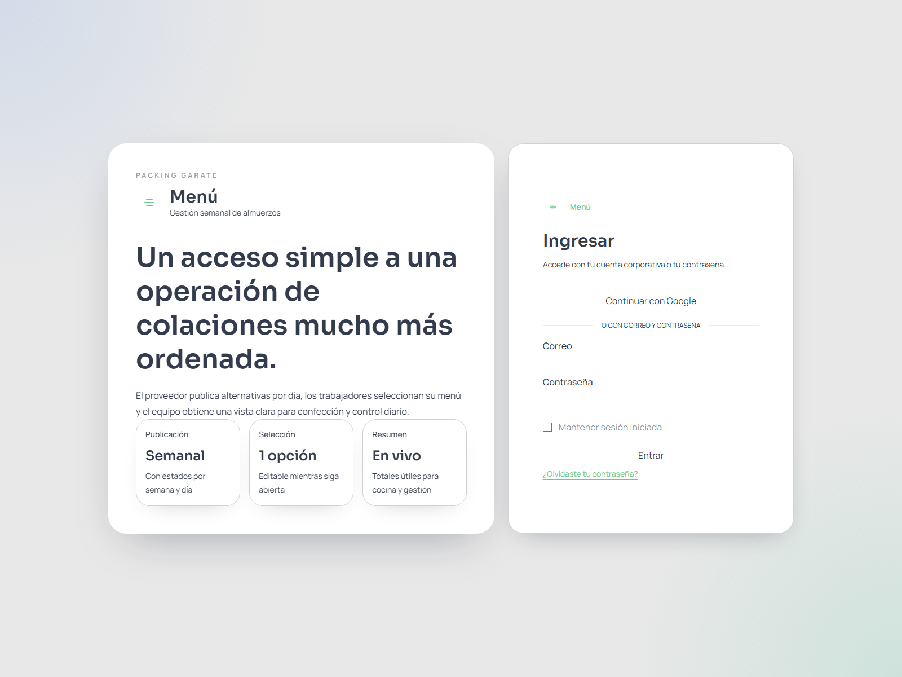
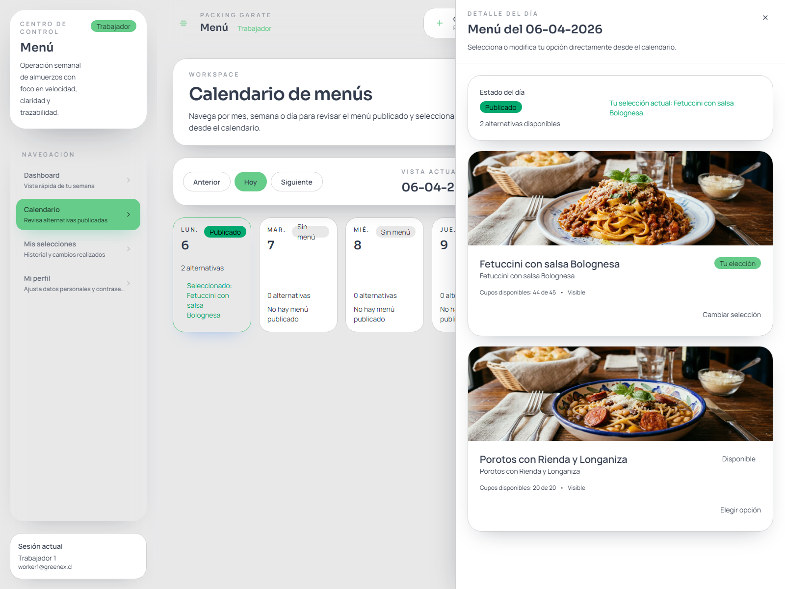

# Manual de Usuario: Trabajador

> Este manual explica cómo acceder a la plataforma **Menú** y usar el perfil **Trabajador** para revisar el calendario, escoger una alternativa diaria y consultar el historial de selecciones.  
> Las capturas fueron tomadas en un ambiente de ejemplo; algunos nombres, fechas o cantidades pueden variar en producción.

*Figura 1. Pantalla de acceso a Menú.*

## 1. Objetivo del perfil Trabajador

El perfil **Trabajador** te permite:

- ingresar al sistema con tu cuenta autorizada
- revisar el menú publicado por fecha
- cambiar entre vista mensual, semanal o diaria
- abrir el detalle de un día sin salir del calendario
- seleccionar una alternativa de almuerzo
- modificar tu selección mientras el período siga abierto
- consultar tu historial de elecciones

## 2. Qué necesitas para ingresar

Para acceder al sistema necesitas:

- la URL oficial entregada por la empresa
- un usuario activo con rol **Trabajador**
- acceso con Google corporativo o con correo y contraseña

## 3. Inicio de sesión

### Opción A: ingreso con Google corporativo

1. Ingresa a la URL del sistema https://menus.appgreenex.cl.
2. Haz clic en **Continuar con Google**.
3. Elige tu cuenta corporativa autorizada.
4. Confirma el acceso.

### Opción B: ingreso con correo y contraseña

1. Ingresa a la URL del sistema https://menus.appgreenex.cl. 
2. Escribe tu correo en **Correo**.
3. Escribe tu clave en **Contraseña**.
4. Si quieres, marca **Mantener sesión iniciada**.
5. Presiona **Entrar**.

Para revisar un menú:

1. Haz clic en Calendario y despues click sobre el día que quieres consultar.
2. Se abrirá un panel lateral a la derecha.
3. En ese panel podrás ver el detalle del menú.

*Figura 4. Drawer del trabajador con alternativas disponibles y selección actual.*

## 4. Seleccionar una alternativa

Dentro del menú verás:

- el estado del día
- tu selección actual, si ya existe
- la lista de alternativas disponibles
- imagen y descripción del plato
- cupos disponibles
- botón para elegir o cambiar tu opción

### Cómo seleccionar un menú por primera vez

1. Abre el día desde el calendario.
2. Revisa las alternativas visibles.
3. Busca el plato que deseas.
4. Haz clic en **Elegir opción**.
5. Espera la confirmación visual.

### Qué ocurre después

- la alternativa quedará marcada como **Tu selección**
- el sistema registrará la fecha y hora de la elección
- si la alternativa tiene cupos limitados, estos se descontarán automáticamente

## 5. Cambiar una selección ya hecha

Si el día o la semana aún no están cerrados, puedes cambiar tu elección:

1. Vuelve a abrir el día desde el calendario.
2. Ubica la nueva alternativa.
3. Haz clic en **Cambiar selección** o en el botón equivalente.
4. Confirma el cambio con la respuesta visual del sistema.

### Reglas importantes

- solo puedes tener **una alternativa por fecha**
- si cambias de opción, la anterior se libera y la nueva queda reservada
- no puedes cambiar si el día o la semana están cerrados
- no puedes elegir opciones ocultas o agotadas

## 6. Buenas prácticas de uso

- revisa el calendario con anticipación
- confirma tu opción apenas el día esté publicado
- si vas a cambiar tu elección, hazlo antes del cierre
- verifica siempre que la alternativa quede marcada como seleccionada

## 7. Solución de problemas

### No veo el menú de un día

Puede deberse a que:

- el proveedor aún no lo publica
- el día está en borrador
- no existe menú para esa fecha

### No puedo cambiar mi selección

Revisa si:

- la semana está cerrada
- el día está cerrado
- la nueva alternativa ya no tiene cupos

### Mi alternativa no aparece

Puede ser que:

- la opción fue ocultada por el proveedor
- la alternativa ya no está disponible para ese día

### No recuerdo lo que seleccioné

Revisa la sección **Mis selecciones** o abre el día en el calendario para ver tu selección actual.

## 8. Resumen

El perfil **Trabajador** está diseñado para operar de forma rápida:

- ingresar al sistema
- revisar el calendario
- abrir el detalle del día
- elegir una alternativa
- modificarla si el período sigue abierto
- consultar el historial cuando lo necesites

Si revisas el calendario con frecuencia, podrás seleccionar a tiempo y evitar quedarte sin cupo en opciones limitadas.
